# Sales Conversion Optimization Project 📈

# Table of Contents 📑

1. [Project Description](#project-description) 📝
2. [Project Structure](#project-structure) 🏗️
3. [Necessary Installations](#necessary-installations) 🛠️
4. [Train Pipeline](#train-pipeline) 🚂
5. [Continuous Integration Pipeline](#continuous-integration-pipeline) 🔁
6. [Alert Reports](#email-report) 📧
7. [Prediction App](#prediction-app) 🎯
8. [Neptune.ai Dashboard](#neptune.ai-dashboard) 🌊
9. [Docker Configuration](#docker-configuration) 🐳
10. [GitHub Actions](#github-actions) 🛠️
11. [Running the Project](#running-the-project) 🚀


# Project Description 🚀

Welcome to the Sales Conversion Optimization Project! 📈 This project focuses on enhancing sales conversion rates through meticulous data handling and efficient model training. The goal is to optimize conversions using a structured pipeline and predictive modeling.

We've structured this project to streamline the process from data ingestion and cleaning to model training and evaluation. With an aim to empower efficient decision-making, our pipelines incorporate quality validation tests, drift analysis, and rigorous model performance evaluations.

This project aims to streamline your sales conversion process, providing insights and predictions to drive impactful business decisions! 📊✨


# Project Structure 🏗️

Let's dive into the project structure! 📁 Here's a breakdown of the directory:

- **steps Folder 📂**
  - ingest_data
  - clean_data
  - train_model
  - evaluation
  - production_batch_data
  - predict_prod_data

- **src Folder 📁**
  - clean_data
  - train_models

- **pipelines Folder 📂**
  - training_pipeline
  - ci_cd_pipeline

- **models Folder 📁**
  - saved best H20.AI model

- **reports Folder 📂**
  - Failed HTML Evidently.ai reports

- **production data Folder 📁**
  - Production batch dataset

- **Other Files 📄**
  - requirements.txt
  - run_pipeline.py
  - ci-cd.py

This organized structure ensures a clear separation of concerns and smooth pipeline execution. 🚀

# Necessary Installations 🛠️

To ensure the smooth functioning of this project, several installations are required:

1. Clone this repository to your local machine.

    ```bash
    git clone https://github.com/VishalKumar-S/Sales_Conversion_Optimization_MLOps_Project
    cd Sales_Conversion_Optimization_MLOps_Project
    ```

2. Install the necessary Python packages.

    ```bash
    pip install -r requirements.txt
    ```

3. ZenML Integration 

    ```bash
    pip install zenml["server"]
    zenml init      #to initialise the ZeenML repository
    zenml up    
    ```

4. Neptune Integration

    ```bash
    zenml experiment-tracker register neptune_experiment_tracker --flavor=neptune \
    --project="$NEPTUNE_PROJECT" --api_token="$NEPTUNE_API_TOKEN"

    zenml stack register neptune_stack \
    -a default \
    -o default \
    -e neptune_experiment_tracker \
    --set
    ```
Make sure to install these dependencies to execute the project functionalities seamlessly! 🌟
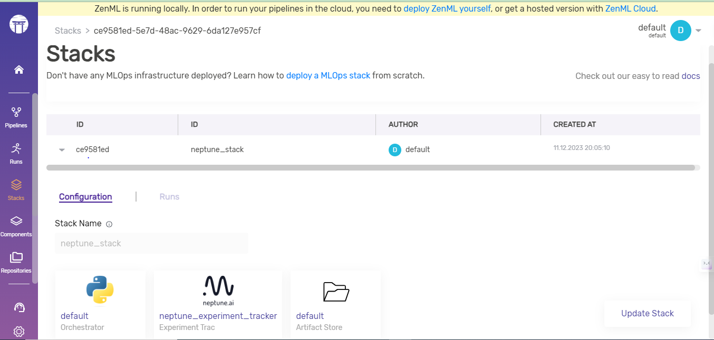


# Train Pipeline 🚂

In this pipeline, we embark on a journey through various steps to train our models! 🛤️ Here's the process breakdown:

1. **run_pipeline.py**: Initiates the training pipeline.
2. **steps/ingest_Data**: Ingests the data, sending it to the data_validation step.
3. **data_validation step**: Conducts validation tests and transforms values.
4. **steps/clean_Data**: Carries out data preprocessing logics.
5. **data_Drift_validation step**: Conducts data drift tests.
6. **steps/train_model.py**: Utilizes h2o.ai AUTOML for model selection.
7. **src/train_models.py**: Implements the best model on the cleaned dataset.
8. **model_performance_Evaluation.py**: Assesses model performance on a split dataset.
9. **steps/alert_report.py**: Here, if any of teh validation test suites, didn't meet the threshold condition, email will be sent to the user, along with the failed Evidently.AI generated HTML reports.

Each step is crucial in refining and validating our model. All aboard the train pipeline! 🌟🚆

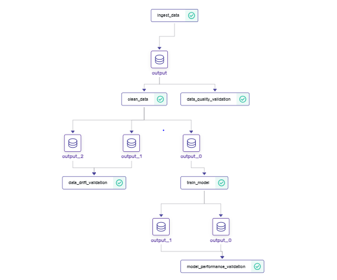


# Continuous Integration Pipeline ⚙️

The continuous integration pipeline focuses on the production environment and streamlined processes for deployment. 🔄

Here's how it flows:

1. **ci-cd.py**: Triggered to initiate the CI/CD pipeline.
2. **steps/production_batch_data**: Accesses production batch data from the Production_data folder
3. **pipelines/ci_cd_pipeline.py**: As we already discussed earlier, we conduct Data Quality, Data Drift as previously we did, if threshold fails, email reports are sent.
4. **steps/predict_production_Data.py**: Utilizes the pre-trained best model to make predictions on new production data. Then, we conduct Model Performance validation as previously we did, if threshold fails, email reports are sent.

This pipeline is crucial for maintaining a continuous and reliable deployment process. 🔁✨

.PNG)
.PNG)


## Alert Reports 📧

In our project, email reports are a vital part of the pipeline to notify users when certain tests fail. These reports are triggered by specific conditions during the pipeline execution. Here's how it works:

### E-mail Details

Upon data quality or data drift test or model performance validation tests failures, an email is generated detailing:

- Number of total tests performed.
- Number of passed and failed tests.
- Failed test reports attached in HTML format.


### Integration with Pipeline Steps

This email functionality is integrated into the pipeline steps via Python scripts (`steps/alert_report.py`). If a particular test threshold fails, the execution pauses and an email is dispatched. Successful test completions proceed to the next step in the pipeline.

This notification system helps ensure the integrity and reliability of the data processing and model performance at each stage of the pipeline.

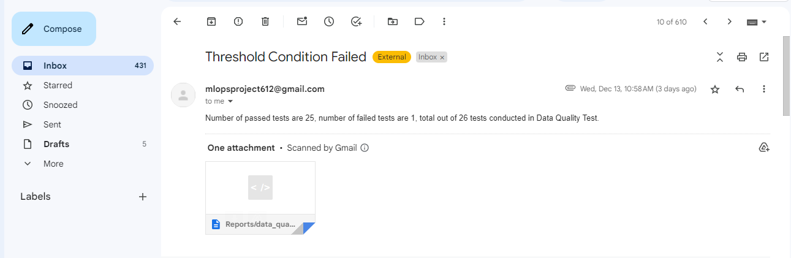
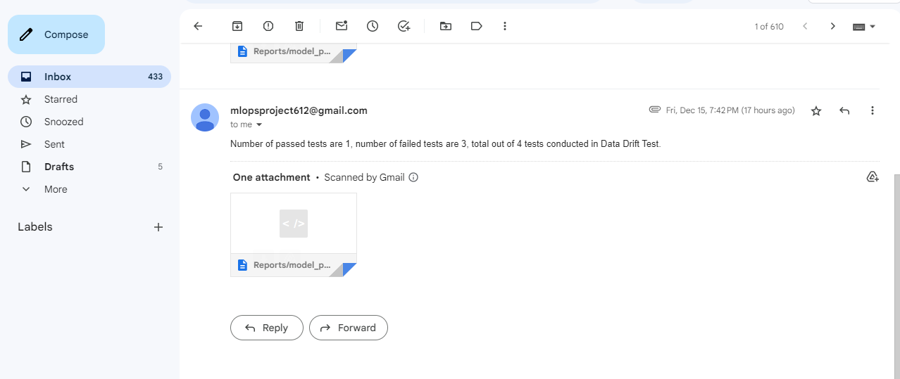
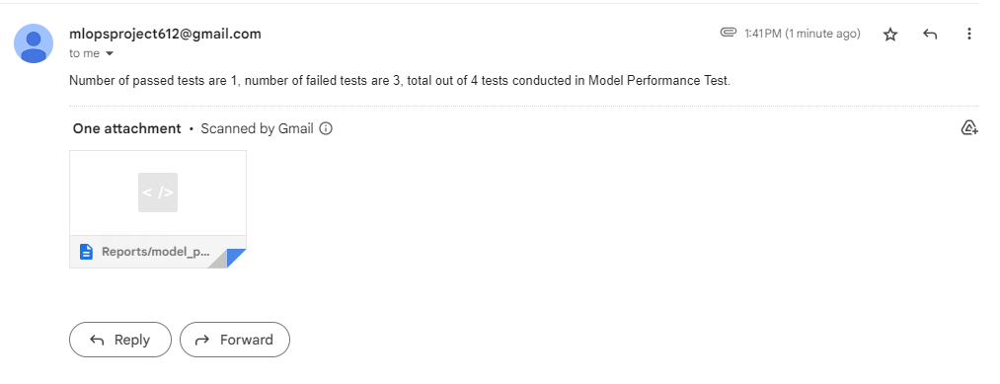

We also send failed alert reports via Discord and Slack platforms.

Discord: [#failed-alerts](https://discord.gg/bxZx6EGVMD)

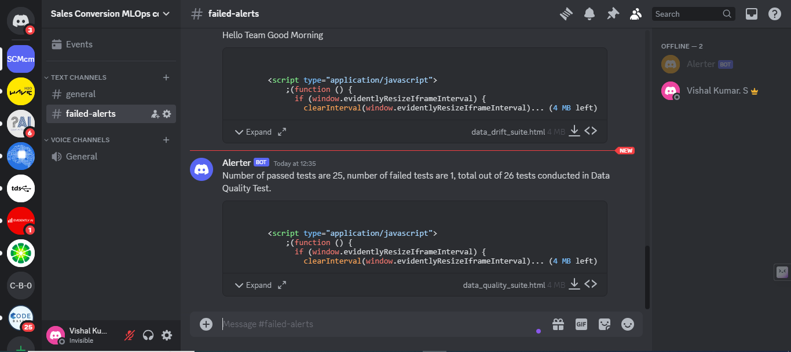

Slack: [#sales-conversion-test-failures](https://join.slack.com/t/vishalsworkspaceco/shared_invite/zt-2b00eaite-KHPsBmlsM2JtsmR2oN0qrQ)

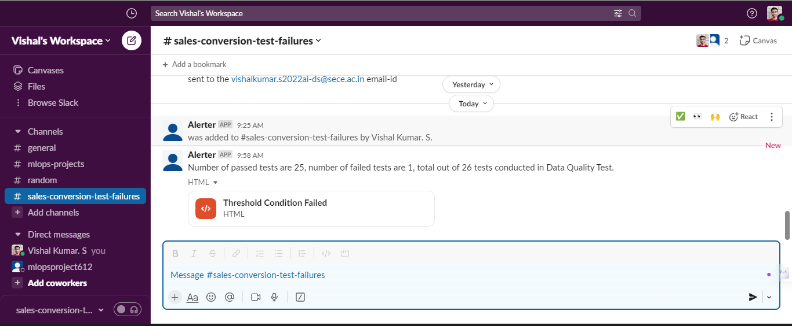


# Prediction App 🚀

The Prediction App is the user-facing interface that leverages the trained models to make predictions based on user input. 🎯
To run the streamlit application,
    ```bash
    streamlit run app.py
    ```

## Functionality:
- 🌐 **Streamlit Application**: User-friendly interface for predictions and monitoring.
- 🚀 **Prediction App**: Input parameters for prediction with a link to Neptune.ai for detailed metrics.
- 📊 **Interpretability Section**: Explore detailed interpretability plots, including SHAP global and local plots.
- 📈 **Data and Model Reports**: View reports on data quality, data drift, target drift, and model performance.
- 🛠️ **Test Your Batch Data Section**: Evaluate batch data quality with 67 validation tests, receive alerts on failures.

This app streamlines the process of making predictions, interpreting model outputs, monitoring data, and validating batch data.

## Prediction App 🚀
### User Input Data
- Fields: Impressions, Clicks, Spent, Total_Conversion, CPC.
- Predict button generates approved conversion predictions.
- 🔗 [Neptune.ai Metrics](https://app.neptune.ai/Vishal-Kumar-S/Sales-Conversion-Optimisation-MLOps-Project)

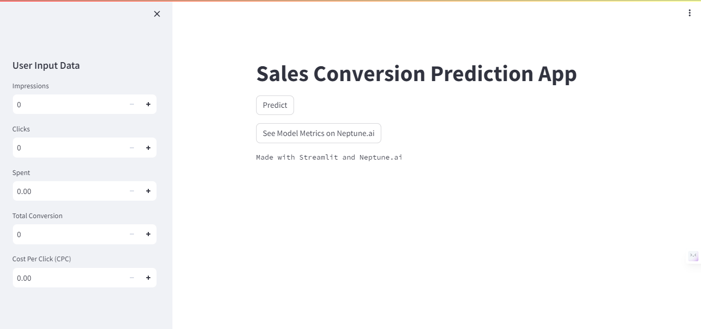


## Interpretability Section
- 📝 **Detailed Interpretability Report**: View global interpretability metrics.
- 🌐 **SHAP Global Plot**: Explore SHAP values at a global level.
- 🌍 **SHAP Local Plot**: Visualize SHAP values for user-input data.

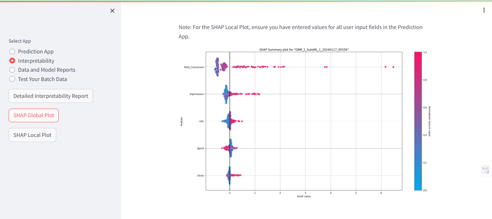

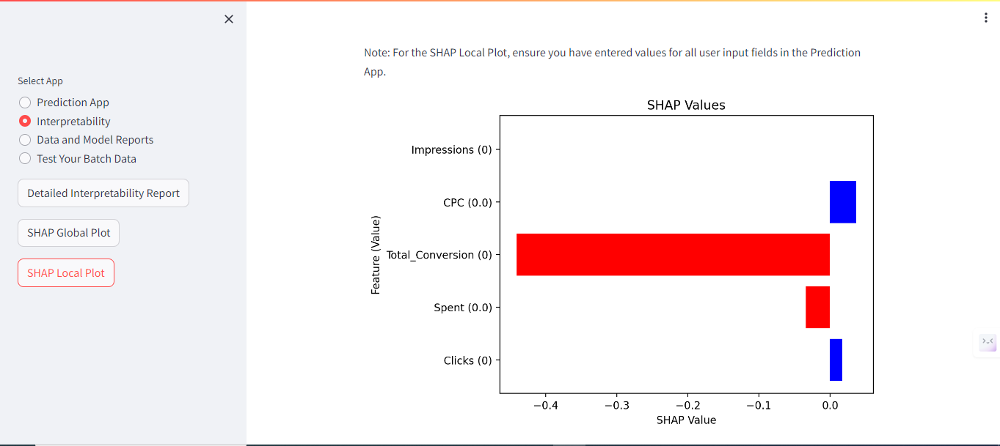


## Data and Model Reports
- 📉 **Data Quality Report**: Assess data quality between reference and current data.
- 📊 **Data Drift Report**: Identify drift in data distribution.
- 📈 **Target Drift Report**: Monitor changes in target variable distribution.
- 📉 **Model Performance Report**: Evaluate the model's performance.

### Choose Reports
- Check options to generate specific reports.
- Click 'Submit' to view generated reports.

.PNG
)

.PNG)


## Test Your Batch Data
1. 📂 **Dataset Upload**: Upload your batch dataset for validation.
2. 📧 **Email Alerts**: Provide an email for failure alerts.
3. 🔄 **Data Validation Progress**: 67 tests to ensure data quality.
4. 📊 **Visualizations**: Scatter plot and residuals plot for validation results.


##### Step 1: Upload Your Batch Dataset

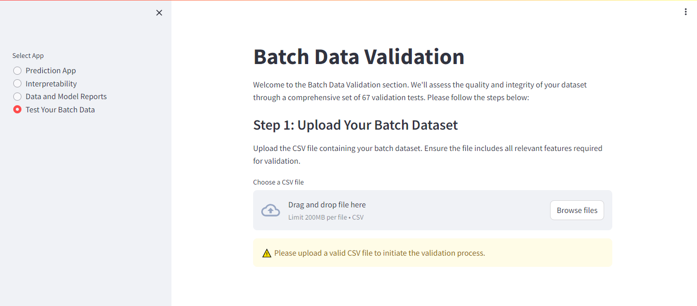
  
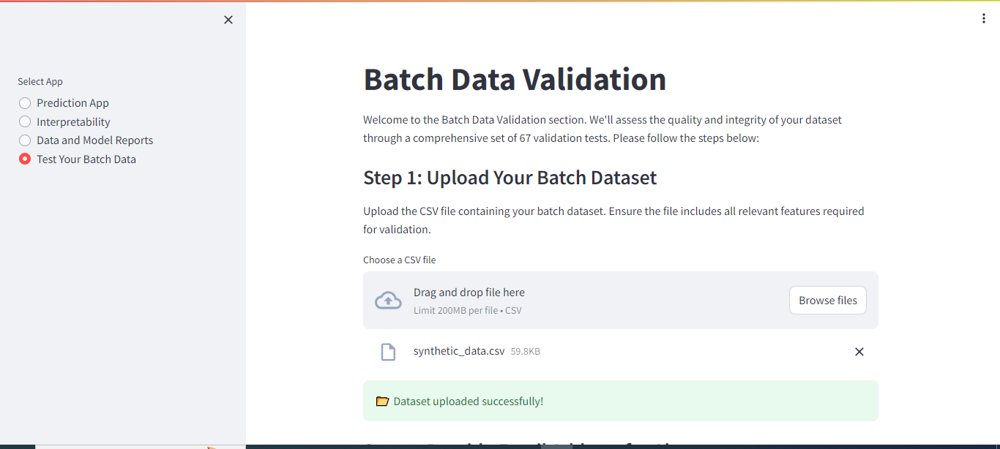

##### Step 2: Provide Email Address for Alerts

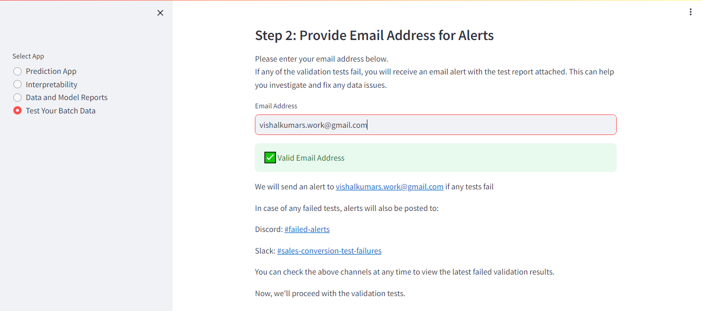

##### Step 3: Data Validation Progress

Successful tests validation: 

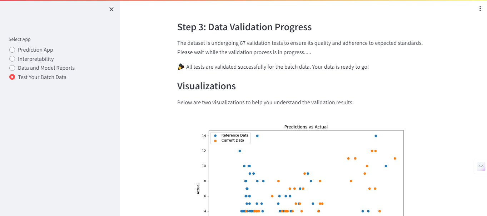

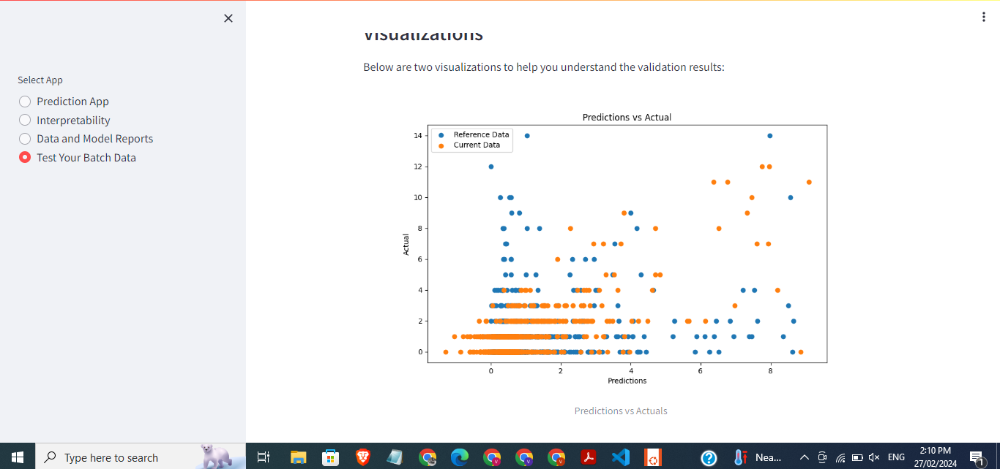

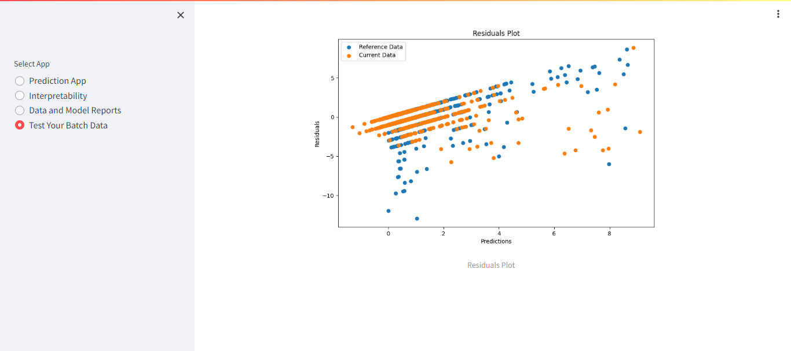


Failed tests validation:
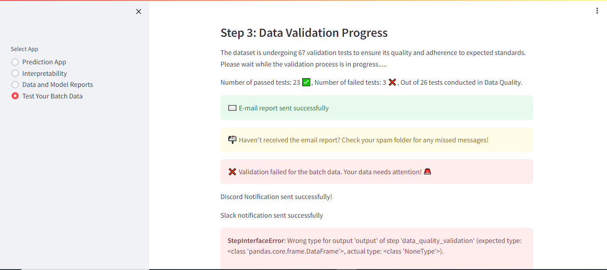


For more details, check the respective sections in the Streamlit app.

This application provides an intuitive interface for users to make predictions and monitoring effortlessly. 📊✨ Explore the power of data-driven insights with ease and confidence! 🚀🔍


# Neptune.ai Dashboard 🌊

## Leveraging the Power of Neptune.ai for Enhanced Insights and Management 🚀

Neptune.ai offers an intuitive dashboard for comprehensive tracking and management of experiments, model metrics, and pipeline performance. Let's dive into its features:

1. **Visual Metrics**: Visualize model performance metrics with interactive charts and graphs for seamless analysis. 📈📊
2. **Experiment Management**: Track experiments, parameters, and results in a structured and organized manner. 🧪📋
3. **Integration Capabilities**: Easily integrate Neptune.ai with pipeline steps for automated tracking and reporting. 🤝🔗
4. **Collaboration Tools**: Facilitate teamwork with collaborative features and easy sharing of experiment results. 🤝💬
5. **Code and Environment Tracking**: Monitor code versions and track environments used during experimentation for reproducibility. 🛠️📦

Necessary Commands:

1. Necessary imports:
    ```bash
    import neptune
    from neptune.types import File
    from zenml.integrations.neptune.experiment_trackers.run_state import get_neptune_run
    ```

2. Initiate the neptune run             
    ```bash
    neptune_run = get_neptune_run()
    ```

3. To track the pandas dataframe: 
    ```bash
    neptune_run["data/Training_data"].upload(File.as_html(df))
    ```

4. Track HTML reports: 
    ```bash
    neptune_run["html/Data Quality Test"].upload("Evidently_Reports/data_quality_suite.html")
    ```

5. Track plot and graph visualisations:        
    ```bash
    neptune_run["visuals/scatter_plot"].upload(File.as_html(fig1))
    ```

6. Track model metrics:
    ```bash
    model["r2"].log(perf.r2())
    model["mse"].log(perf.mse())
    model["rmse"].log(perf.rmse())
    model["rmsle"].log(perf.rmsle())
    model["mae"].log(perf.mae())
    ```
Neptune.ai Dashboard runs:
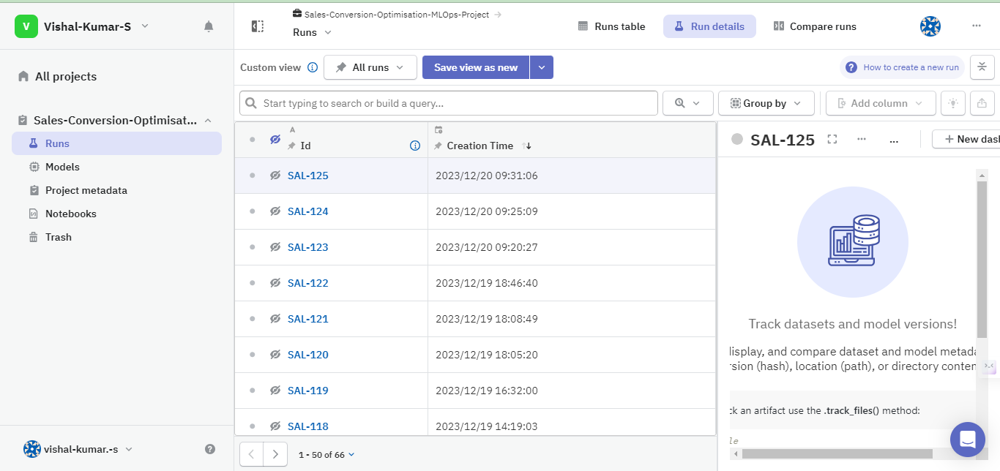

Neptune.ai Dashboard Code files:
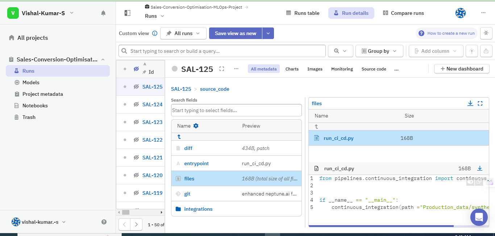

Neptune.ai Dashboard Datasets:
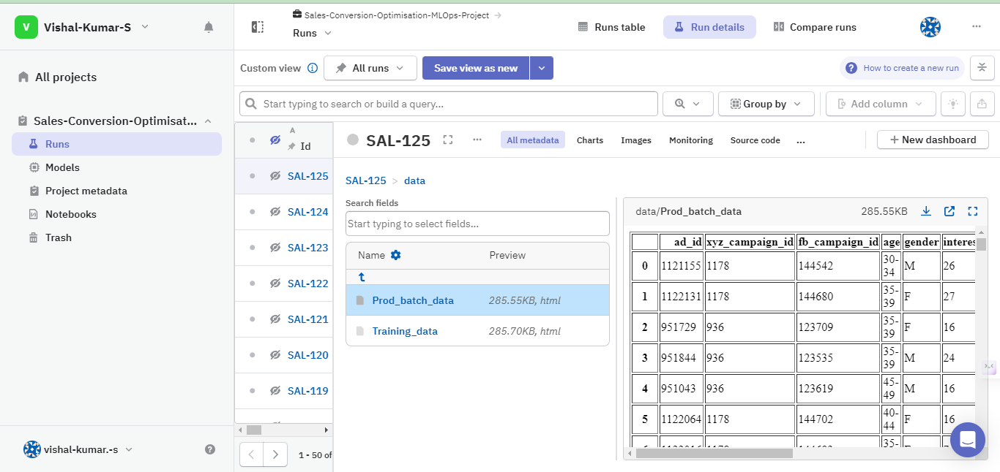

Neptune.ai Dashboard visualisations:
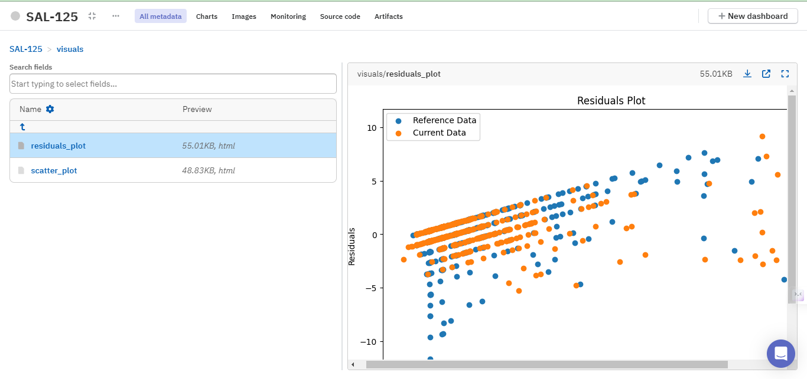

Neptune.ai Dashboard HTML reports:
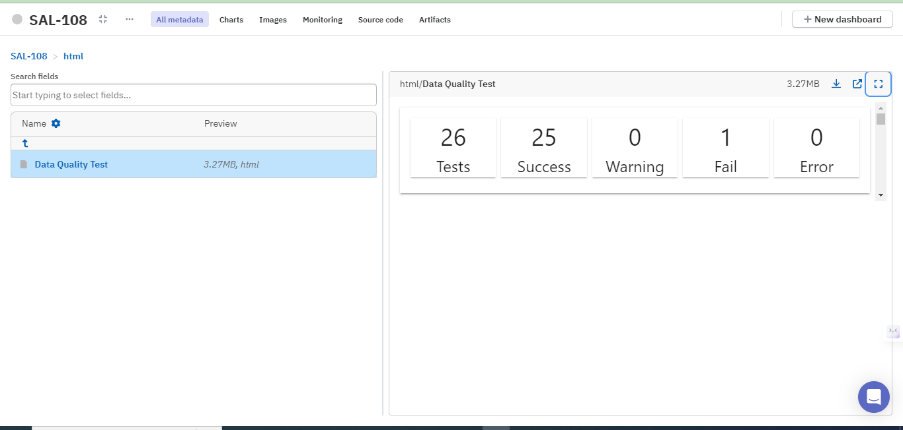

Neptune.ai Dashboard models:
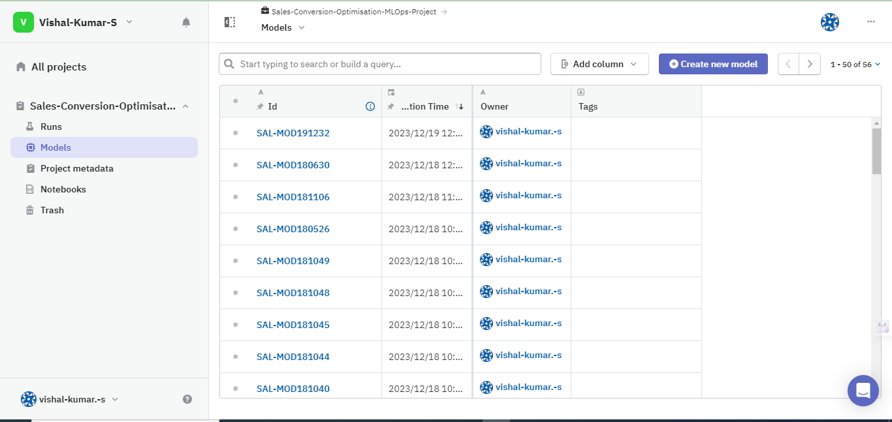

Neptune.ai Dashboard model metrics:
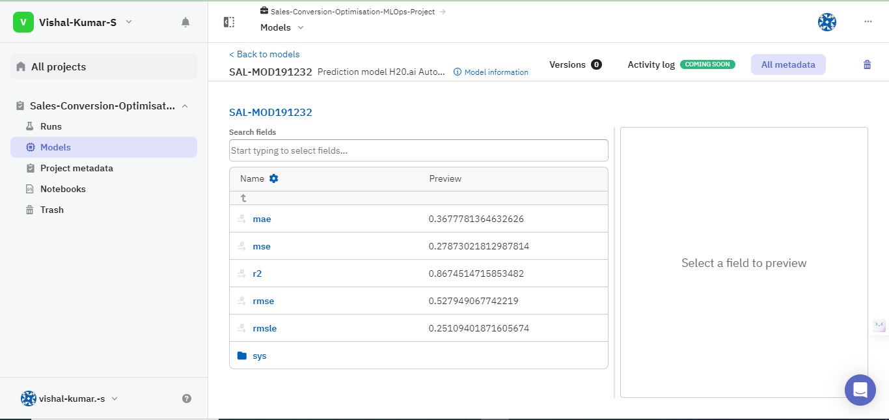

Access my Neptune.ai Dashboard [here](https://app.neptune.ai/o/Vishal-Kumar-S/org/Sales-Conversion-Optimisation-MLOps-Project)

Neptune.ai enhances the project by providing a centralized platform for managing experiments and gaining deep insights into model performance, contributing to informed decision-making. 📊✨


# Docker Configuration 🐳

Docker is an essential tool for packaging and distributing applications. Here's how to set up and use Docker for this project:

**Running the Docker Container:** Follow these steps to build the Docker image and run a container:

    ```bash
    docker build -t my-streamlit-app .
    docker run -p 8501:8501 my-streamlit-app
    ```

**Best Practices:** Consider best practices such as data volume management, security, and image optimization.

## GitHub Actions 🛠️

- Configured CI/CD workflow for automated execution

# Continuous Machine Learning (CML) Reports 📊

## CML Reports Integration 🚀

🎯 Predictions Scatter Plot: Visualizes model predictions against actual conversions.
📈 Residuals Plot: Illustrates the differences between predicted and actual values.

## GitHub Actions Workflow 🛠️

Integrated into CI/CD pipeline:
- Automatic generation on every push event.
- Visual insights available directly in the repository.

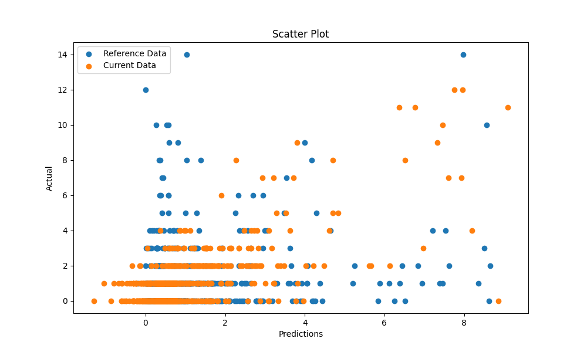
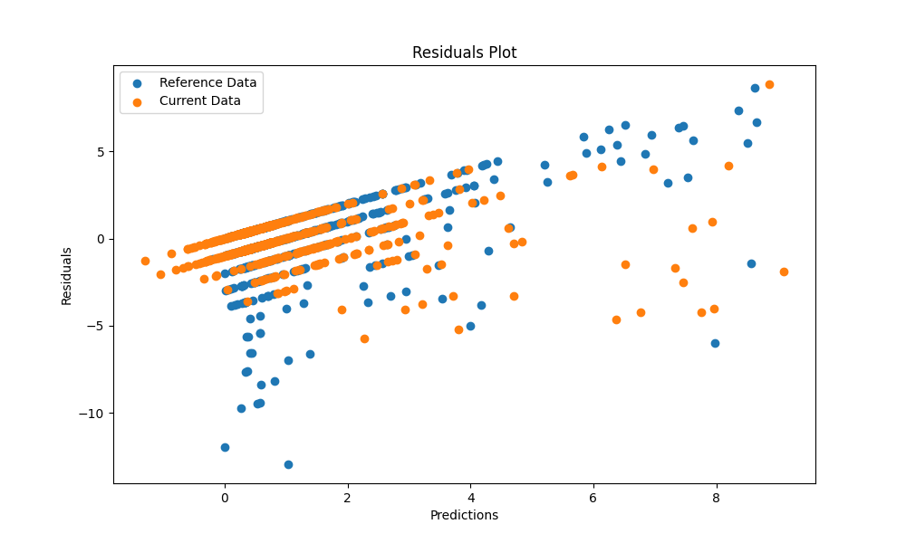

🌟 These reports enhance transparency and provide crucial insights into model performance! 🌟


# Running the Project 🚀

Follow these steps to run different components of the project:

1. **Training Pipeline**:
   - To initiate the training pipeline, execute 
   ```bash
    python run_pipeline.py
    ```
2. **Continuous Integration Pipeline**:
   - To execute the CI/CD pipeline for continuous integration, run
   ```bash
   python run_ci_cd.py
   ```

3. **Streamlit Application**:
   - Start the Streamlit app to access the prediction interface using,
    ```bash
   streamlit run app.py
   ```

Each command triggers a specific part of the project. Ensure dependencies are installed before executing these commands. Happy running! 🏃‍♂️✨


